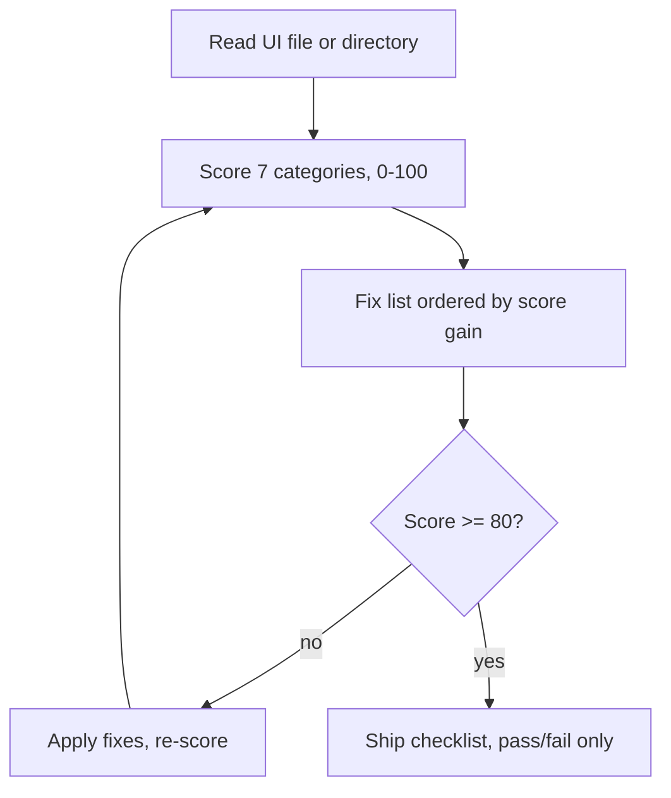

# design-review-gate

Scores a UI file or directory 0–100 against a concrete design rubric, then returns a prioritized fix list ordered by score gain — not just a list of complaints, a path to a better number.

## Install

```bash
git clone <this-repo> ~/.claude/skills/design-review-gate
# or copy directly
cp -r /path/to/design-review-gate ~/.claude/skills/design-review-gate
```

## Usage

```
/design-review-gate src/Dashboard.tsx
/design-review-gate src/components/
```

Also runs implicitly as a self-gate right after generating any UI, before showing it to the user.

## What it does



- Scores seven weighted categories — coherence, color discipline, hierarchy/typography, layout/spacing, states, UX writing, motion/polish — each starting at full marks with cited, line-numbered deductions
- Returns fixes ordered by score gain, so the highest-leverage change comes first
- Runs a separate pass/fail ship checklist (favicon, alt text, semantic HTML, 404, form validation) that doesn't affect the score
- Applies house rules on top of the base rubric: cardless layouts score full marks when deliberate, and one discordant design gesture is allowed rather than penalized
- Re-screenshots and visually verifies when a renderer (headless Chrome, playwright MCP, a running dev server) is available, and discloses when it can't

## What it doesn't do

- Does not edit or delete code — it measures and recommends; fixes are applied only when asked
- Does not fabricate a visual review — if no renderer is available, the review is disclosed as code-only
- Does not chase 100 — the bar is a floor (~80), not a target to perfect before shipping

## Requirements

None beyond Claude Code itself. Visual verification (the pixel gate) additionally benefits from one of: headless Chrome, the playwright MCP, or a running local dev server — optional, not required to get a code-level score.

## License

MIT. Rubric cherry-picked from [StyleSeed](https://github.com/bitjaru/styleseed) (MIT) and [elayadesign/ai-design-skills](https://github.com/elayadesign/ai-design-skills) (MIT); house rules and pixel-gate layer original to this fork.
